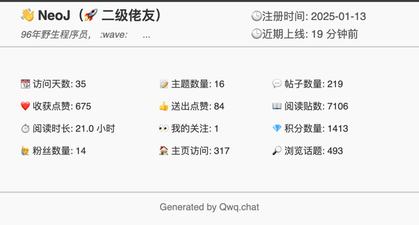

### card
不同网站的个人名片构建。

### Linux.do 支持

* https://xxx/card/{neoj.svg} 个人名片

* http://127.0.0.1:8000/card/neoj.svg?theme=auto

* `neoj`为用户名，我这里用自己的作测试，你可以用你的用户名替换。
* `theme` 为主题，可选值为 `auto`、`dark`、`light`，默认为 `auto`。

### demo

